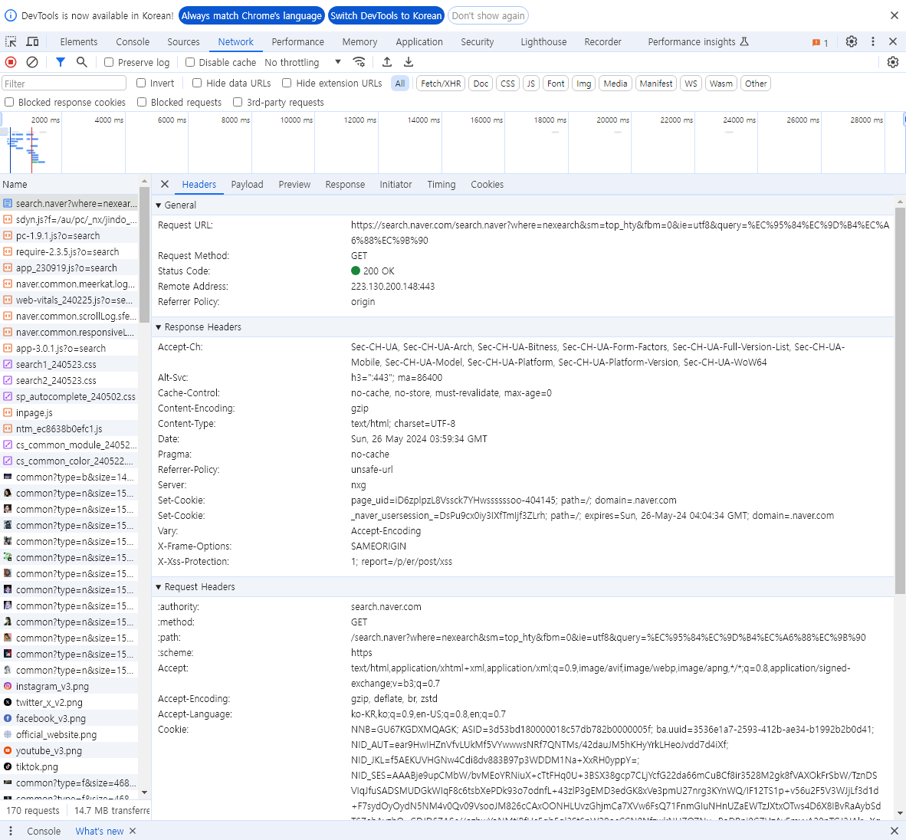
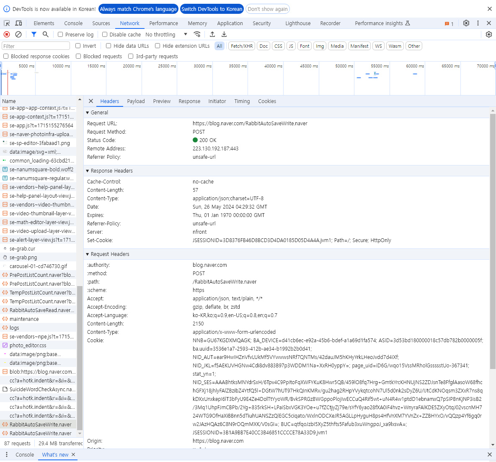
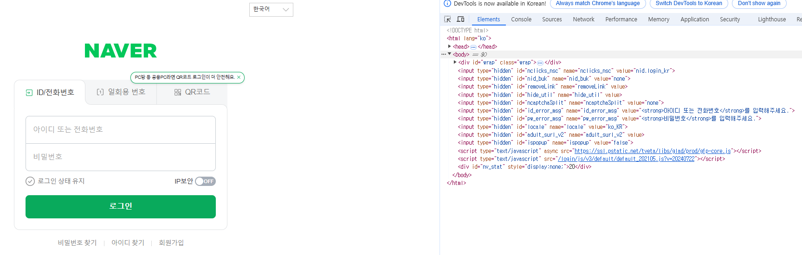
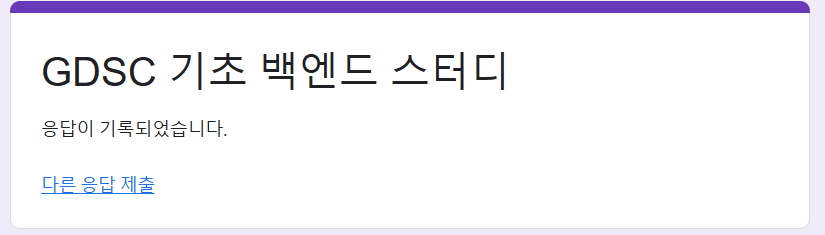

# HTTP Method 정리

## 1. HTTP Method 종류

### 1.1 GET 메소드의 특징
- 클라이언트가 서버로부터 리소스를 요청할 때 사용하는 메소드입니다.
- 데이터를 서버에 전달하기보다는 **특정 리소스를 가져오는 용도**로 사용됩니다.
- 예를 들어, 검색창에서 검색을 하는 경우를 생각할 수 있습니다. 이때 검색 결과가 URL에 포함되어 전달됩니다.

#### 장점
- **서버 상태를 변경하지 않음**: GET 요청은 서버의 데이터나 상태를 변경하지 않습니다.
- **캐싱 가능**: 브라우저나 프록시 서버가 요청 결과를 캐싱할 수 있어 빠른 응답을 제공합니다.

#### 단점
- **민감한 정보 전달에 부적합**: URL에 데이터가 노출되기 때문에 비밀번호 같은 민감한 정보에는 적합하지 않습니다.
- **데이터 크기 제한**: URL 길이에 제한이 있어 전송할 수 있는 데이터 양이 제한됩니다.

#### GET 메소드 예시

### 1.2 POST 메소드의 특징
- 클라이언트가 서버로 **데이터를 전송**할 때 사용하는 메소드입니다.
- 주로 새로운 리소스를 생성하거나 서버의 상태를 변경할 때 사용됩니다.
- 예를 들어, 로그인하거나 블로그에 글을 작성하는 경우 POST 메소드가 사용됩니다.

#### POST 메소드 예시

---

## 2. `<form>` 태그와 사용법

`<form>` 태그는 웹페이지에서 **사용자 데이터를 입력받고 서버에 전송**하기 위한 HTML 태그입니다.

### 주요 속성 및 사용법
- **action**: 데이터를 전송할 URL을 지정합니다.
- **method**: 데이터를 전송할 HTTP 메소드를 지정합니다 (예: GET, POST).
- **input 태그**: 데이터를 입력받을 수 있으며, `type` 속성으로 입력 양식을 지정할 수 있습니다.
- **submit 버튼**: `type="submit"` 또는 `<button>` 태그를 사용하여 제출 버튼을 생성할 수 있습니다.
- **name 속성**: 정보를 전송할 때 각 데이터의 키를 지정할 수 있습니다.

### `<form>` 태그 예시
`<form>` 태그 내에 여러 `<input>` 태그를 중첩하여 다양한 데이터를 입력받고, `action` 속성으로 지정된 URL로 데이터를 전송합니다. 이때 `method` 속성에 지정된 HTTP 메소드로 데이터를 전송합니다.

#### `<form>` 태그 활용 사례
- **로그인 및 회원가입**
- **설문조사**
- **파일 업로드**

> 네이버 로그인 화면에는 직접적인 `<form>` 태그는 보이지 않지만, `<input>` 태그를 통해 데이터 입력 필드를 제공합니다.

---

## 3. 추가적으로 공부하기

### 3.1 Redirect와 PRG 패턴
- **Redirect**: 웹에서 사용자가 특정 작업을 수행한 후 **다른 페이지로 이동시키는 방식**입니다. 주로 폼 제출 후 새로고침 등의 반복 요청을 방지하기 위해 사용됩니다.
- **PRG (Post/Redirect/Get) 패턴**: 폼 제출 후 `POST` 요청을 보내고, 요청 처리가 완료되면 **Redirect를 통해 다른 페이지로 이동**시킵니다. 이후 `GET` 요청으로 결과 페이지를 표시하여 데이터 중복 전송을 방지하는 디자인 패턴입니다.

> 예: 구글 폼에서 설문을 제출하면 “제출이 완료되었습니다” 페이지로 이동하는 과정

### 3.2 CSRF (Cross-Site Request Forgery)
CSRF는 **사용자가 인지하지 못하는 사이에 공격자가 사용자 대신 서버에 요청을 보내는 공격 방식**입니다. 인증된 사용자의 세션을 악용하여 피해자가 의도하지 않은 요청을 서버에 전송하게 만듭니다.

#### CSRF 방지 방법
1. **CSRF 토큰 사용**: 서버에서 생성된 토큰을 요청과 함께 보내고, 서버는 토큰의 유효성을 검사합니다.
2. **참조 헤더 검사**: 요청의 `Referer` 헤더를 확인하여 올바른 출처인지 검사합니다.
3. **SameSite 쿠키 설정**: 쿠키에 SameSite 속성을 설정하여 동일한 사이트에서 발생한 요청에만 쿠키를 전송합니다.
4. **GET 요청 제한**: 서버의 상태를 변경하는 작업에는 GET 요청을 사용하지 않고, POST 등 안전한 요청을 사용합니다.
